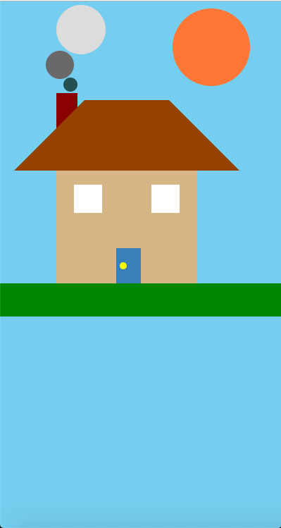
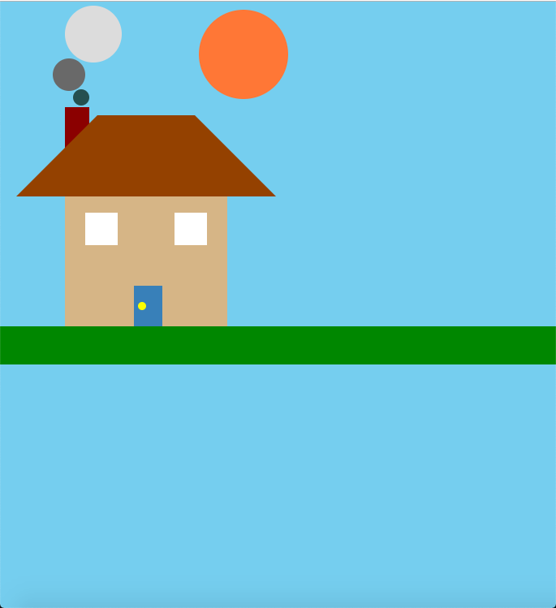
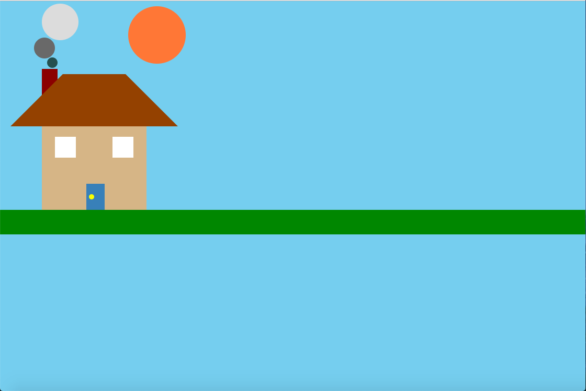
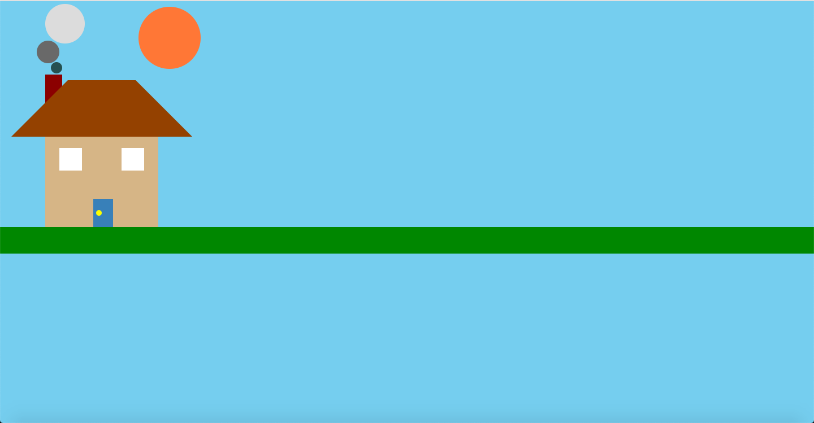

# CSS House

### How To Start
> 1. Go to the project's folder
> 2. Right click on the file named _index.html_
> 3. Chose the _open with_ option
> 4. Chose the browser you want to open it in

### About
- This is just a simple drawing made using CSS

### Preview

